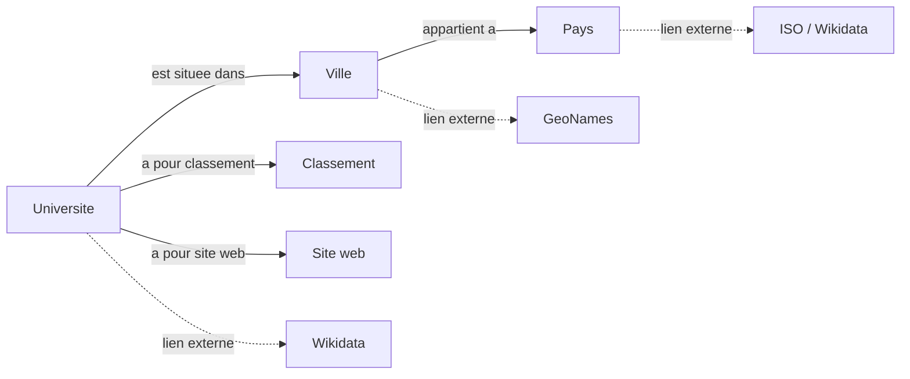

# Carte des entités et des liens potentiels

## 1. Inventaire des entités

| Entité | Exemple | Pourquoi entité | Attributs | ID potentiel |
| --- | --- | --- | --- | --- |
| Université | ENSIAS | Objet réel | Ranking, Students | Website |
| Ville | Rabat | Localisation réelle | Nom | GeoNames ID |
| Pays | Maroc | Entité géographique | Nom | ISO |
| Classement | 1 | Concept mesurable | Valeur | ID interne |
| Étudiants | 1200 | Quantité | Nombre | - |
| Site web | ensias.ma | Ressource unique | URL | URL |
| Domaine | Informatique | Catégorie | Nom | Wikidata |
| Institution | Université publique | Type | Catégorie | - |

---

## 2. Relations conceptuelles

| Source | Relation | Cible | Cardinalité | Commentaire |
| --- | --- | --- | --- | --- |
| Université | est située dans | Ville | 1-N | classique |
| Ville | est dans | Pays | N-1 | hiérarchie |
| Université | a classement | Classement | 1-1 | attribut |
| Université | a étudiants | Étudiants | 1-1 | attribut |
| Université | a site | Website | 1-1 | identifiant |

---

## 3. Liens externes proposés

| Entité | Ressource | Type | Critère | Justification | Bénéfice | Confiance | Risque |
| --- | --- | --- | --- | --- | --- | --- | --- |
| Université | Wikidata | sameAs | Nom + site | correspondance | enrichissement | Moyen | homonymes |
| Ville | GeoNames | exact match | Nom | standard geo | géolocalisation | Élevé | villes dupliquées |
| Pays | Wikidata | exact match | Nom | stable | interopérabilité | Élevé | faible |
| Domaine | DBpedia | close match | Nom | enrichir domaine | sémantique | Moyen | ambigu |
| Université | DBpedia | sameAs | Nom | enrichissement | infos extra | Moyen | confusion |

👉 Référentiels utilisés : Wikidata + GeoNames

---

## 4. Schéma conceptuel

